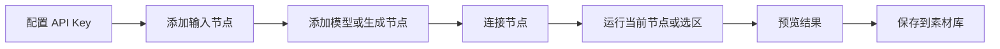

# AI Workbench

AI Workbench 是一个 API 驱动的可视化 AI 创作工作台。

它的目标不是接入本地 ComfyUI，而是提供类似 ComfyUI 的节点式自由度。你可以把文本、提示词、图片、视频、模型参数和素材库组合成自己的创作流程。

## 5 分钟版

本地开发：

```bash
npm install
npm run dev
```

服务器默认用单进程 SaaS 模式：

```bash
npm install
cp .env.example .env
npm run check:deploy
npm run start:server
```

正式服务器推荐前端静态托管、后端只提供 API。具体配置见 [部署模式清单](docs/deployment-modes.md)。

本地开发打开：

```text
http://127.0.0.1:5173
```

如果已经构建过，后续只启动服务：

```bash
npm start
```

## 核心功能

| 功能 | 说明 |
|---|---|
| 节点画布 | 拖拽节点，连接节点，组合创作工作流 |
| 文本模型 | 调用兼容 OpenAI 或其他文本 API |
| 图片生成 | 支持文生图、参考图、模型参数和批量结果 |
| 视频生成 | 支持字节 Ark、阿里百炼等视频模型适配 |
| 模型能力 | 按模型配置支持的尺寸、时长、参考图数量等限制 |
| 任务历史 | 查看生成任务、错误、耗时和产物 |
| 素材库 | 把角色、参考图、项目素材分组保存和复用 |
| 服务器部署 | 支持 SQLite、outputs 持久化和 PM2 常驻 |

## 推荐使用方式

先配置 API，再创建工作流。



常用工作流：

| 场景 | 节点组合 |
|---|---|
| 文本测试 | 文本输入 -> 文本模型 -> 预览 |
| 文生图 | 文本输入 -> 图片生成 -> 预览 |
| 剧本到分镜 | 文本输入 -> 剧本生成 -> 分镜拆解 -> 预览 |
| 分镜生图 | 分镜拆解 -> 提示词优化 -> 图片生成 -> 预览 |
| 多图生视频 | 多图输入 -> 视频生成 -> 预览 |

## API 模式选择

| 类型 | 谁来配置 | 适合场景 |
|---|---|---|
| 平台提供 API | 管理员 | 统一计费、普通用户一键选模型 |
| 我的 API | 当前账号 | 你自带第三方 Key，不走平台积分 |

管理员在 `/admin` 管理平台模型和服务器 Key。普通用户在左侧 `我的 API` 里保存自己的 Key。

## 运行节点

默认推荐一步一步运行，不建议一开始就运行整个画布。

| 操作 | 说明 |
|---|---|
| 重跑此节点 | 强制重新执行当前节点 |
| 运行到此节点 | 自动运行上游依赖，复用已完成且输入没变的节点 |
| 运行选区 | Shift 多选或框选节点后执行，只补齐必要依赖 |
| 运行全部 | 复用完整工作流模板时使用 |

已完成且输入没有变化的节点会复用结果，避免重复消耗 API。

## 文档入口

| 文档 | 用途 |
|---|---|
| [使用说明](docs/user-guide.md) | 给实际使用者看的完整操作说明 |
| [部署模式](docs/deployment-modes.md) | 本地开发、默认单机服务器、高级分进程配置 |
| [服务器部署](docs/server-deploy.md) | 服务器部署、PM2、端口和故障排查 |
| [前端静态托管](docs/frontend-static-hosting.md) | Nginx、Vercel、OSS/CDN 托管前端 |
| [API 设计](docs/api-design-v2.md) | 后端 API 和数据结构设计 |
| [工作流执行语义](docs/workflow-execution-semantics.md) | 端口值类型、连线推断、22 种节点契约、执行顺序、指纹复用与校验规则 |
| [API 契约](docs/api-contract.md) | 94 个路由清单、全局响应约定、鉴权模型与自动化契约检查说明 |
| [节点清单（JSON）](docs/node-registry.json) | 机器可读的 22 种节点定义：端口、配色、配置字段、connection 规则。重写前端时作为陈设依据，`npm run export:node-registry` 重新生成 |
| [流水线与 SaaS 落地方案](docs/pipeline-saas-roadmap.md) | 服务端工作流编排、积分定价、运维兜底、商业化与扩容的分阶段方案 |

## 常用命令

本项目是**纯后端**。前端在 `../frontend`（独立仓库），有自己的构建流程。

启动：

```bash
npm start            # 等价于 node server/index.cjs
npm run start:server # 先跑部署检查再启动
```

检查：

```bash
npm test             # 594 测试
npm run lint         # 期望 0 警告
npm run check:types  # src/ 下节点注册表源头的类型检查（tsc -b）
npm run check:routes # docs/api-contract.md 路由清单与后端实际注册是否一致
npm run check:mojibake
npm run check:deploy
node scripts/checkRegistrySync.cjs ../frontend   # 前端注册表副本是否同步
```

服务器后台运行：

```bash
pm2 start server/index.cjs --name ai-workbench --cwd /home/admin/apps/ai-workbench
pm2 save
pm2 status
```

健康检查：

```bash
curl http://127.0.0.1:3000/api/health
```

## 数据位置

服务器建议把数据库和产物放到独立持久目录：

```bash
WORKBENCH_DATA_DIR=/home/admin/apps/ai-workbench-data/data
WORKBENCH_DB_PATH=/home/admin/apps/ai-workbench-data/data/ai-workbench.sqlite
IMAGE_OUTPUT_DIR=/home/admin/apps/ai-workbench-data/outputs
```

需要备份时，重点备份：

| 路径 | 内容 |
|---|---|
| `WORKBENCH_DB_PATH` | API Key、任务历史、素材库元数据 |
| `IMAGE_OUTPUT_DIR` | 图片、视频等生成资产 |

## 当前注意事项

- 服务器部署默认要求登录。首次部署前要配置管理员账号，或确认数据库里已经有启用的管理员。
- `WORKBENCH_KEY_SECRET` 必须长期保存。改掉后，旧的服务器 Key 可能无法解密。
- 服务器重启后是否自动恢复，取决于是否正确配置了 `pm2 startup`。
- 如果浏览器打不开，但服务器 `curl 127.0.0.1:3000/api/health` 正常，通常是安全组或防火墙没放行 `3000`。
