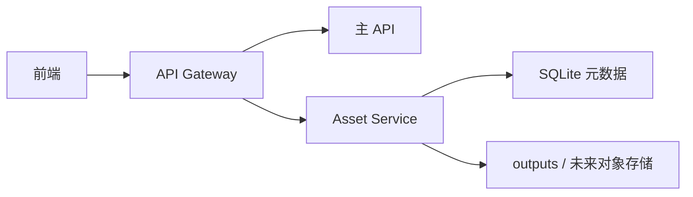

# Asset Service 拆分说明

结论：`asset-service` 是第二个服务边界。它把素材库、上传、资产读取、素材集合从主 API 中拆出来，后续可以单独接对象存储。

## 5 分钟版

启动 asset-service：

```bash
npm run start:asset-service
```

默认监听本机：

```bash
WORKBENCH_ASSET_SERVICE_HOST=127.0.0.1
WORKBENCH_ASSET_SERVICE_PORT=3002
```

让 Gateway 转发素材请求：

```bash
WORKBENCH_GATEWAY_ASSET_URL=http://127.0.0.1:3002
```

配置后，这些请求会先进入 asset-service：

| 路由 | 用途 |
| --- | --- |
| `/api/assets/*` | 素材列表、上传、读取 |
| `/api/images/:imageId` | 旧图片读取兼容 |
| `/api/asset-collections/*` | 素材集合 |
| `/api/asset-collection-templates` | 素材集合模板 |

## 为什么要拆它

素材库会越来越重。它会包含上传、缩略图、集合、搜索、对象存储、下载权限和容量配额。

先拆出 asset-service，可以让后面迁移 S3、R2、OSS、MinIO 时，不影响登录、模型、工作流和生成任务。



## asset-service 负责什么

| 能力 | 当前实现 |
| --- | --- |
| 素材列表 | `GET /api/assets` |
| 图片上传 | `POST /api/assets/upload` |
| 素材读取 | `GET /api/assets/:assetId` |
| 旧图片兼容 | `GET /api/images/:imageId` |
| 素材集合 | `/api/asset-collections/*` |
| 集合模板 | `GET /api/asset-collection-templates` |
| 健康检查 | `GET /api/health` |

它不负责这些能力：

| 不负责 | 应该留给 |
| --- | --- |
| 图片生成、视频生成 | `worker-service` |
| 登录、注册、Session | `auth-service` 或当前主 API |
| API Key、模型能力、模型测试 | `model-service` 或当前主 API |
| 工作流保存、版本 | `workflow-service` 或当前主 API |

## 和 `/api/images` 的关系

`/api/images` 有两个历史含义：

| 请求 | 服务 |
| --- | --- |
| `POST /api/images` | 创建图片生成任务，走 `worker-service` |
| `GET /api/images/:imageId` | 读取旧图片，走 `asset-service` |

Gateway 已按 HTTP 方法区分这两个方向。这样开启 worker-service 和 asset-service 后，图片生成和旧图片读取不会互相抢路由。

## 内部身份规则

asset-service 不直接处理浏览器登录。它只信任 Gateway 注入的内部用户上下文：

```text
x-workbench-user-id
```

server 模式下，请求没有这个头会返回 `401`。

如果配置了内部服务 token：

```bash
WORKBENCH_INTERNAL_SERVICE_TOKEN=换成一段随机长字符串
```

asset-service 会要求请求带同样的：

```text
x-workbench-internal-token
```

Gateway 转发时会自动附带这个头。浏览器伪造的内部头会先被 Gateway 丢弃。

## 验证命令

```bash
node --test server/assetServiceApp.test.cjs server/gatewayService.test.cjs server/processBoundary.test.cjs
node --check server/assetServiceApp.cjs
node --check server/assetService.cjs
```

完整回归：

```bash
npm test
npx tsc -b --pretty false
npm run lint
npm run build
```
