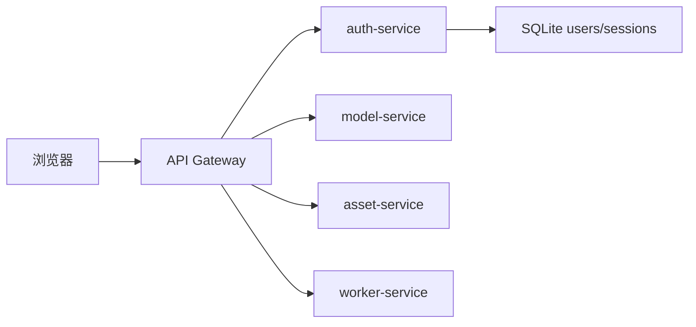

# Auth Service 拆分说明

结论：`auth-service` 负责登录、注册、邮箱验证码、Session、后台用户管理、邀请码和审计日志。它默认只监听本机，公网入口仍然应该是 Gateway。

## 5 分钟版

启动 auth-service：

```bash
npm run start:auth-service
```

默认监听：

```bash
WORKBENCH_AUTH_SERVICE_HOST=127.0.0.1
WORKBENCH_AUTH_SERVICE_PORT=3004
```

让 Gateway 转发登录相关请求：

```bash
WORKBENCH_GATEWAY_AUTH_URL=http://127.0.0.1:3004
```

配置后，这些请求会进入 auth-service：

| 路由 | 用途 |
| --- | --- |
| `/api/auth/me` | 查看当前登录态和注册策略 |
| `/api/auth/login` | 邮箱和密码登录 |
| `/api/auth/logout` | 退出当前 Session |
| `/api/auth/sessions/*` | 查看和管理当前用户 Session |
| `/api/auth/register/*` | 邮箱验证码注册 |
| `/api/auth/password-reset/*` | 邮箱验证码重置密码 |
| `/api/admin/users` | 管理员创建用户、改密、禁用用户 |
| `/api/admin/audit-logs` | 管理员查看审计日志 |
| `/api/admin/invitations` | 管理员管理邀请码 |

## 为什么要拆它

SaaS 版最先要稳定身份边界。登录态、Cookie、Session、用户权限、邮箱验证码都属于 auth 边界。先把它拆出来，可以让后续 `model-service`、`asset-service`、`worker-service` 只信任 Gateway 注入的用户上下文，不再自己处理浏览器登录。



## Cookie 规则

auth-service 和其他内部服务不一样。它需要读取浏览器登录 Cookie，才能处理 `/api/auth/me`、退出登录和 Session 管理。

| 上游服务 | Gateway 是否转发 Cookie |
| --- | ---: |
| `auth-service` | 是 |
| `worker-service` | 否 |
| `asset-service` | 否 |
| `model-service` | 否 |

Gateway 仍会剥离浏览器伪造的内部头，再重新写入可信上下文：

```text
x-workbench-user-id
x-workbench-user-role
x-workbench-session-id
x-workbench-internal-token
```

## 内部服务 Token

如果 auth-service 和 Gateway 不在同一台机器，建议配置同一段内部 token：

```bash
WORKBENCH_INTERNAL_SERVICE_TOKEN=换成一段随机长字符串
```

auth-service 的后台管理路由会要求 Gateway 注入内部 token。公开登录和注册路由不要求用户身份，因为用户还没有登录。

## 它不负责什么

| 不负责 | 应该留给 |
| --- | --- |
| 图片、视频、文本任务执行 | `worker-service` 或 `worker` |
| 素材上传、读取、集合 | `asset-service` |
| API Key、模型能力、厂商适配 | `model-service` |
| 工作流保存、版本、模板 | `workflow-service` 或当前主 API |

## 验证命令

```bash
node --check server/authServiceApp.cjs
node --check server/authService.cjs
node --test server/authServiceApp.test.cjs server/gatewayService.test.cjs server/processBoundary.test.cjs
```

完整回归：

```bash
npm test
npx tsc -b --pretty false
npm run lint
npm run build
```
