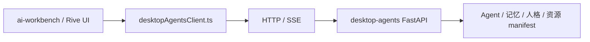

# Desktop Agents 对接说明

## 5 分钟版

结论：`ai-workbench` 作为外部前端，只通过 HTTP 和 SSE 调用 `desktop-agents` 后端。前端不导入 Python 模块，不读取后端本地目录，也不复制人格、记忆、回复路由逻辑。

已提供统一入口：

```text
src/lib/desktopAgentsClient.ts
src/lib/desktopAgentAnimationState.ts
```

开发时先启动后端：

```powershell
cd F:\xmlg\agent\desktop-agents
$env:PYTHONPATH='F:\xmlg\agent\desktop-agents'
python run_api.py
```

前端环境变量：

```env
VITE_DESKTOP_AGENTS_URL=http://127.0.0.1:8000
```

## 为什么这样接

你后续可能重做宠物外观、Rive 界面或 Electron 外壳。前端形态会变，但后端“大脑”不该跟着变。

所以边界要固定在协议层：



## 当前客户端能力

| 函数 | 用途 |
| --- | --- |
| `desktopAgentsHealth()` | 检查后端是否启动 |
| `listDesktopAgents()` | 读取 Agent 列表 |
| `getDesktopAgentManifest(agentId)` | 读取动画 manifest |
| `getDesktopMemoryStatus()` | 读取记忆 worker 状态 |
| `getDesktopRecentEvents(limit)` | 读取最近事件 |
| `queryDesktopMemoryContext(payload)` | 查询记忆上下文 |
| `streamDesktopAgentChat(agentId, message, onEvent)` | 发起流式聊天 |
| `parseDesktopAgentSseMessages(text)` | 解析 SSE 文本，供测试和调试复用 |

## 动画状态选择

结论：前端只读取 manifest，不把 Rive runtime 放进 `desktop-agents`。`desktopAgentAnimationState.ts` 会把后端状态转成渲染层需要的描述。

| 字段 | 含义 |
| --- | --- |
| `state` | 实际命中的动画状态 |
| `requestedState` | 后端事件请求的状态 |
| `mood` | 当前情绪 |
| `speaking` | 是否说话 |
| `assetKind` | `rive`、`gif`、`frames` 或 `none` |
| `assetUrl` | 当前优先资源路径 |
| `inputs` | Rive 状态机可消费的通用输入 |
| `fallback` | 是否从请求状态回退到其他状态 |

资源优先级固定为：

```text
Rive > GIF > PNG frames
```

## 最小调用示例

```ts
import {
  listDesktopAgents,
  getDesktopAgentManifest,
  streamDesktopAgentChat,
} from './lib/desktopAgentsClient';
import { selectDesktopAnimationState } from './lib/desktopAgentAnimationState';

async function run() {
  const agents = await listDesktopAgents();
  const first = agents[0];
  if (!first) return;

  const manifest = await getDesktopAgentManifest(first.id);
  const animation = selectDesktopAnimationState(manifest, { state: 'idle', speaking: false });
  console.log(animation.assetKind, animation.assetUrl, animation.inputs);

  await streamDesktopAgentChat(first.id, '你好，测试一下聊天流', (event) => {
    console.log(event.event, event.data);
  });
}
```

## 边界红线

- 前端不要导入 `desktop-agents` 的 Python 文件。
- 前端不要直接读写 `assets/characters/` 或 `models/`。
- 聊天时不要重复写历史，`chat-stream` 已由后端落库。
- 前端只消费 manifest 和事件，不把后端业务规则搬到组件里。
- Rive 渲染、透明窗口、拖拽、状态机播放都留在前端项目内实现。

## 验收命令

```powershell
cd F:\API_ui\工作台\ai-workbench
npm test
npm run build
```

同时可以在 `desktop-agents` 仓库跑：

```powershell
cd F:\xmlg\agent\desktop-agents
$env:PYTHONPATH='F:\xmlg\agent\desktop-agents'
python tools\frontend_smoke_check.py --base-url http://127.0.0.1:8000
```
