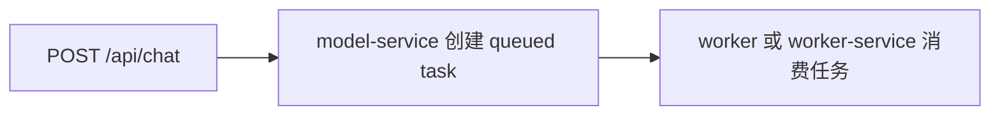

# Model Service 拆分说明

结论：`model-service` 是第三个服务边界。它把模型列表、API Key 管理与测试、模型能力、厂商模板、文本任务入口和可选通用代理从主 API 中拆出来。

## 5 分钟版

启动 model-service：

```bash
npm run start:model-service
```

默认监听本机：

```bash
WORKBENCH_MODEL_SERVICE_HOST=127.0.0.1
WORKBENCH_MODEL_SERVICE_PORT=3003
WORKBENCH_MODEL_SERVICE_START_QUEUE=false
```

让 Gateway 转发模型相关请求：

```bash
WORKBENCH_GATEWAY_MODEL_URL=http://127.0.0.1:3003
```

配置后，这些请求会进入 model-service：

| 路由 | 用途 |
| --- | --- |
| `/api/models` | 获取上游模型列表 |
| `/api/api-keys/*` | API Key 管理和测试 |
| `/api/model-capabilities/*` | 模型能力维护 |
| `/api/model-capability-presets` | 内置模型能力模板 |
| `/api/providers` | 厂商模板 |
| `/api/chat`、`/api/claude` | 创建文本任务 |
| `/api/proxy` | 可选通用代理 |

## 为什么要拆它

模型能力和 API Key 是 SaaS 版的核心边界。它们决定：

| 关注点 | 说明 |
| --- | --- |
| 权限 | 普通用户只能管自己的 Key，管理员才能管 server key |
| 安全 | 明文 Key 不进入前端持久化，也不进日志 |
| 适配 | 不同厂商、不同模型能力可以独立维护 |
| 扩展 | 后续模型测试、厂商文档导入、能力自动发现都可以放在这里 |

## 默认不消费文本任务

model-service 默认只创建文本任务，不消费任务：

```bash
WORKBENCH_MODEL_SERVICE_START_QUEUE=false
```

也就是说：



如果你只是本地小规模部署，也可以打开：

```bash
WORKBENCH_MODEL_SERVICE_START_QUEUE=true
```

但生产建议让 worker 统一消费任务，避免模型请求拖慢 HTTP 服务。

## 管理员权限

model-service 不直接读取浏览器 Cookie。它信任 Gateway 注入的内部用户上下文：

```text
x-workbench-user-id
x-workbench-user-role
```

管理员操作依赖 `x-workbench-user-role=admin`。Gateway 会先过滤浏览器伪造的内部头，再写入真实登录用户角色。

如果配置了内部服务 token：

```bash
WORKBENCH_INTERNAL_SERVICE_TOKEN=换成一段随机长字符串
```

model-service 会要求请求带同样的：

```text
x-workbench-internal-token
```

## model-service 不负责什么

| 不负责 | 应该留给 |
| --- | --- |
| 图片/视频任务执行 | `worker-service` 或 `worker` |
| 素材读取、上传、集合 | `asset-service` |
| 登录、注册、Session | `auth-service` 或当前主 API |
| 工作流保存、版本 | `workflow-service` 或当前主 API |

## 验证命令

```bash
node --test server/modelServiceApp.test.cjs server/gatewayService.test.cjs server/processBoundary.test.cjs
node --check server/modelServiceApp.cjs
node --check server/modelService.cjs
```

完整回归：

```bash
npm test
npx tsc -b --pretty false
npm run lint
npm run build
```
