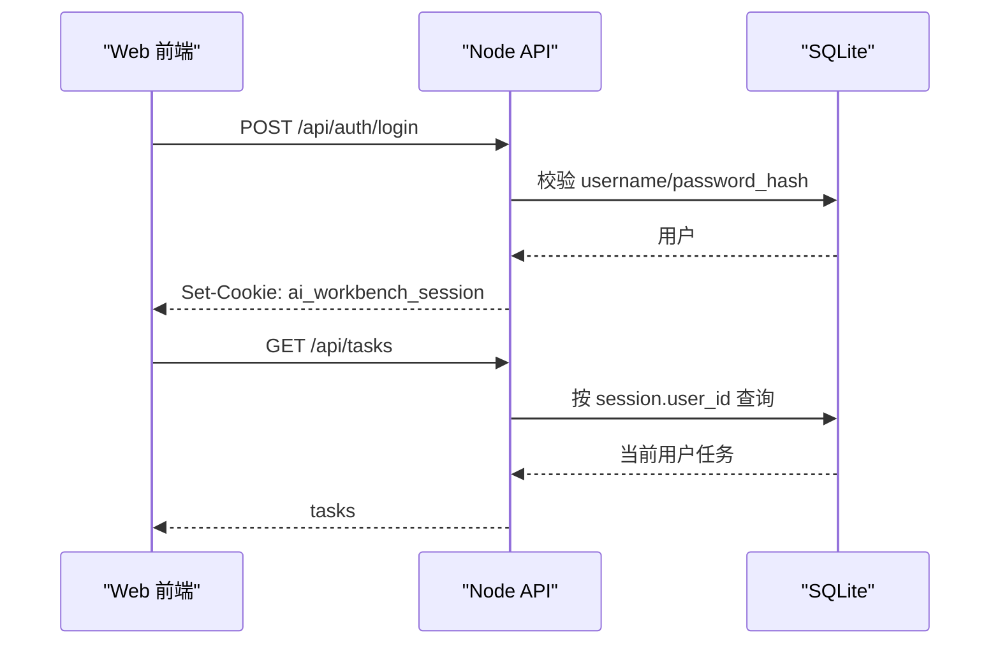

# SaaS 架构约束

## 5 分钟版

AI Workbench 后续按前后端分离演进。

前端只负责：

- 画布、节点、素材库、任务历史等交互。
- 调用后端 API。
- 展示后端返回的任务、资产和模型能力。

后端负责：

- 登录、会话、用户身份。
- API Key 加密保存和权限校验。
- 模型调用、模型能力适配。
- 任务队列、任务历史、执行日志。
- 资产保存、资产 URL、素材库集合。

核心原则：浏览器不再作为可信后端。凡是涉及钱、Key、权限、资产归属、任务状态的逻辑，都放到 Node 服务端。

## 为什么这样做

浏览器版本适合个人本地试用，但不适合直接变成多人服务。

主要风险是：

- 前端代码对访问者可见，不能保护 API Key。
- 浏览器本地存储不适合保存多人资产和任务。
- 只靠前端区分用户很容易被伪造。
- 生成任务会花钱，必须由后端做限流、权限和审计。
- 后续接对象存储、Redis 队列、登录系统时，必须有后端边界。

所以，后续新增功能默认先问一句：这个能力是否需要可信执行？如果需要，就放后端。

## 分层设计

| 层 | 职责 | 当前实现 | 后续方向 |
| --- | --- | --- | --- |
| Web 前端 | 画布 UI、节点配置、预览 | React + Vite | 可单独部署到 CDN 或静态服务器 |
| API 后端 | 鉴权、模型代理、任务、资产 | Node + Express | 独立 API 服务 |
| 数据库 | 用户、Key、任务、资产元数据 | SQLite | PostgreSQL |
| 文件存储 | 图片、视频、文本产物 | 本地 outputs | S3 / R2 / OSS / MinIO |
| 队列 | 生成任务调度 | 进程内执行 | Redis / BullMQ |

前端静态托管的可复制配置见 [前端静态托管说明](./frontend-static-hosting.md)。

## API 边界

前端只能通过 `/api/*` 访问业务能力。

前端不要直接：

- 调第三方模型 API。
- 保存明文 API Key。
- 决定 `user_id`。
- 拼本地文件路径。
- 修改任务状态。
- 修改资产归属。

后端必须：

- 从 session 解析当前用户。
- 根据当前用户查询任务、资产、集合。
- 根据模型能力表过滤请求参数。
- 记录任务输入、输出、错误和耗时。
- 返回可访问的资产 URL，而不是暴露真实磁盘路径。

## 登录与用户

第一阶段使用私有服务器登录。

流程：

后续可以替换为真正的登录系统，但任务、资产和 Key 表不需要重构。

## 开发规则

- 新 API 必须先经过后端鉴权。
- 新表必须带 `user_id`、`created_at`、`updated_at`，除非它是全局配置表。
- 前端状态可以缓存展示，但不能作为真实数据源。
- 模型能力、任务状态、资产归属以后端为准。
- 本地模式可以保留便利开关，服务器模式必须安全优先。

## 近期落地顺序

1. 登录会话：服务器模式默认要求登录。
2. 用户隔离：任务、资产、素材集合按当前用户过滤。
3. Key 管理：用户 Key 和服务器 Key 都由后端加密保存。
4. 任务队列：生成型节点创建后端任务。
5. 存储抽象：本地 outputs 保留，接口预留对象存储。
