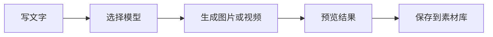

# AI Workbench 使用说明

这份说明给普通使用者看。

你不需要懂代码。你只需要知道怎么打开网站、配置 API、添加节点、运行工作流、保存素材。

## 5 分钟上手

你可以把 AI Workbench 理解成一个“AI 创作流程搭建器”。

你把不同节点连起来，就能完成一条创作流程。



最简单的图片工作流：

```text
文本输入 -> 图片生成 -> 预览
```

最简单的视频工作流：

```text
文本输入 -> 视频生成 -> 预览
```

## 页面区域

| 区域 | 作用 |
|---|---|
| 顶部栏 | 保存工作流、运行、打开任务、日志和账号入口 |
| 左侧栏 | 打开工作流库、素材库、我的 API 和账号安全 |
| 中间画布 | 摆放节点、连接节点、运行流程 |
| 右侧栏 | 修改节点设置、查看输入输出、运行当前节点 |
| 底部节点栏 | 添加文本、图片、视频、预览等节点 |

## 登录和找回密码

如果网站开启了登录，你会先看到邮箱登录页。

常见操作：

| 操作 | 怎么做 |
|---|---|
| 登录 | 输入邮箱和密码，点 `登录` |
| 注册 | 点 `注册账号`，填写邮箱、昵称和密码，再输入邮件验证码 |
| 忘记密码 | 点 `忘记密码？`，输入邮箱，收到验证码后设置新密码 |

重置密码成功后，系统会自动登录。

如果登录后还停在登录页，先刷新页面再试一次。仍然不行时，把页面上的错误提示发给管理员。

## 第一步：配置 API

先点左侧钥匙图标 `我的 API`。如果管理员已经配置了平台模型，你也可以直接在节点的模型选择里选 `平台提供 API`。

你会看到两个常用选项：

| 选项 | 适合谁 |
|---|---|
| 平台提供 API | 管理员统一配置，普通用户直接选择模型 |
| 我的 API | 你自己填第三方 Key，只属于当前账号 |

普通用户不能填写服务器 Key。服务器 Key 由管理员在 `/admin` 里托管。

### 添加 API 时怎么填

| 字段 | 说明 | 示例 |
|---|---|---|
| 名称 | 给这个 API 起个名字 | `我的图片接口` |
| Provider | API 类型 | 一般选 `OpenAI 兼容` |
| Base URL | API 地址 | `https://openaidns.net` |
| API Key | 你的密钥 | `sk-...` |
| 模型列表 | 可用模型 | 自动获取或手动添加 |

> 名称必须填写。名称为空时保存不会成功。

保存成功后，左侧列表会出现这条 API。

## 第二步：添加节点

在底部节点栏选择节点。

常用节点：

| 节点 | 什么时候用 |
|---|---|
| 文本输入 | 写主题、要求、提示词 |
| 图片输入 | 放一张参考图 |
| 多图输入 | 放多张参考图 |
| 文本模型 | 生成文案、改写、扩写 |
| 剧本生成 | 把主题变成剧本 |
| 分镜拆解 | 把剧本拆成镜头 |
| 提示词优化 | 把普通描述变成生图提示词 |
| 图片生成 | 生成图片 |
| 视频生成 | 生成视频 |
| 预览 | 查看结果 |

## 第三步：连接节点

把一个节点连到另一个节点。

系统会自动判断这条线代表什么。

比如：

| 你这样连 | 系统会理解为 |
|---|---|
| 文本输入 -> 图片生成 | 把文本当作图片 prompt |
| 图片输入 -> 图片生成 | 把图片当作参考图 |
| 图片生成 -> 预览 | 预览生成图片 |
| 分镜拆解 -> 图片生成 | 按每个镜头生成图片 |

如果自动判断不对，点一下连线，在右侧修改“连接用途”。

## 使用素材库

素材库适合保存能反复复用的图片。

比如一个角色可以建一个 `角色` 集合，把三视图、脸部特写、表情、服装参考都放进去。

新建集合时可以选择这些模板：

| 模板 | 适合保存 |
|---|---|
| 角色 | 三视图、脸部特写、表情、服装、动作 |
| 场景 | 场景概念图、环境氛围、机位、光照 |
| 产品 | 产品主图、细节、包装、材质、广告参考 |
| 参考图组 | 首帧、尾帧、风格、构图、色彩参考 |

图片输入节点可以直接点 `从素材库选择`。

这样你不用重新上传图片，也不用复制图片 URL。

## 第四步：运行节点

推荐一步一步运行。

不要一开始就点 `运行全部`。

| 按钮 | 作用 |
|---|---|
| 重跑此节点 | 只重新运行当前节点 |
| 运行到此节点 | 自动运行它需要的上游节点 |
| 运行选区 | 只运行你选中的几个节点 |
| 运行全部 | 运行整个画布 |

系统会复用已经完成、且输入没有变化的节点。

这可以避免重复花费 API。

## 第五步：查看结果

结果可以在三个地方看：

| 位置 | 能看到什么 |
|---|---|
| 预览节点 | 当前流程输出 |
| 任务 | 每次生成记录、错误、耗时 |
| 素材库 | 已保存、可复用的图片和视频 |

如果生成失败，先打开 `任务` 看错误信息。

常见错误：

| 错误 | 可能原因 |
|---|---|
| API Key is required | 没选 API 或 Key 没保存 |
| model is required | 没选模型 |
| Failed to fetch | 网站没有连上后端服务 |
| HTTP 401 | Key 不正确或无权限 |
| HTTP 400 | 模型不支持当前参数 |

## 常用工作流

### 文本生成图片

适合生成插画、角色、场景图。

```text
文本输入 -> 图片生成 -> 预览
```

操作：

1. 在 `文本输入` 写你想要的画面。
2. 在 `图片生成` 选择 API 和模型。
3. 点 `运行到此节点` 或 `运行选区`。
4. 在 `预览` 查看结果。

### 剧本生成分镜

适合做短视频脚本、广告分镜。

```text
文本输入 -> 剧本生成 -> 分镜拆解 -> 预览
```

操作：

1. 文本输入写主题。
2. 剧本生成输出故事结构。
3. 分镜拆解输出镜头列表。
4. 预览节点查看每个镜头。

### 分镜生成图片

适合把每个镜头变成画面。

```text
分镜拆解 -> 提示词优化 -> 图片生成 -> 预览
```

图片生成节点收到分镜列表后，会按镜头生成图片。

### 参考图生成新图

适合角色一致性、风格延续、图生图。

```text
图片输入 -> 图片生成
文本输入 -> 图片生成
图片生成 -> 预览
```

操作：

1. 图片输入放参考图。
2. 文本输入写想怎么改。
3. 图片生成会同时使用文本和参考图。

### 多图生成视频

适合首尾帧、产品展示、角色视频。

```text
多图输入 -> 视频生成 -> 预览
```

不同视频模型支持的时长、比例、参考图数量可能不同。

如果参数不支持，页面会提示或任务会失败。

## 素材库怎么用

素材库用来保存可复用素材。

比如你生成了一组角色图：

| 素材 | 用途 |
|---|---|
| 正面图 | 角色主设定 |
| 侧面图 | 保持角色结构 |
| 背面图 | 三视图完整性 |
| 脸部特写 | 保持五官一致 |
| 表情图 | 做后续分镜参考 |

你可以把这些图放进一个素材组。

建议按这些方式整理：

| 素材组 | 放什么 |
|---|---|
| 角色 | 人物设定、三视图、表情 |
| 场景 | 房间、街道、城市、自然环境 |
| 产品 | 产品图、包装图、细节图 |
| 项目 | 某个视频或广告的所有素材 |

后续做新图或视频时，可以从素材库拿图继续当参考。

如果这些图来自同一批任务，可以打开 `任务`：

1. 先用搜索或状态筛选找到这批结果。
2. 选择要加入的素材集合和素材角色。
3. 点 `归档已加载结果`。

系统会把当前已加载结果里的图片和视频去重后批量加入集合。如果还有更多任务没有加载，先点 `加载更多任务`。

## 模型能力是什么意思

不同模型有不同限制。

比如：

| 限制 | 例子 |
|---|---|
| 图片尺寸 | 只支持 `1024x1024` |
| 视频时长 | 只能生成 5 到 10 秒 |
| 参考图数量 | 最多 2 张 |
| 是否支持反向词 | 有些模型不支持 |
| 是否支持 seed | 有些模型不支持固定 seed |

如果你发现某个模型一直失败，可能不是 Key 错，而是参数不符合模型限制。

管理员可以在 `/admin` 的平台模型和模型能力里查看或调整。

## 运行建议

| 建议 | 原因 |
|---|---|
| 先跑小流程 | 更容易发现问题 |
| 优先运行当前节点或选区 | 避免重复花费 API |
| 生成前检查模型 | 模型选错会失败 |
| 保存好素材 | 好图可以反复复用 |
| 失败先看任务详情 | 错误原因一般在那里 |

## 常见问题

### 点保存没反应

先检查 `名称` 是否填写。

名称不能为空。

### 平台提供 API 和我的 API 选哪个

想统一计费、统一模型列表，选平台提供 API。

想用自己的第三方 Key，选我的 API。

### 为什么我看不到服务器 Key

服务器 Key 由管理员统一托管。普通用户只看到平台模型，不直接接触服务器 Key。

这样可以避免把共享密钥暴露在工作台里。

### 为什么朋友看不到我的 API

我的 API 只属于当前账号。

朋友要共用同一套模型，请让管理员配置平台提供 API。

### 运行到此节点会不会重复生成

默认不会重复生成已经完成且输入没变的节点。

如果你点 `重跑此节点`，才会强制重新生成。

## 工作流版本

每次保存工作流，系统都会自动生成一个版本快照。

你可以在 `工作流` 面板里点击某个工作流的 `版本`。

| 操作 | 作用 |
|---|---|
| 保存当前 | 保存画布，并生成一个新版本 |
| 复制 | 复制一份新的工作流 |
| 版本 | 查看最近保存记录 |
| 回滚 | 把工作流恢复到某个旧版本 |

如果工作流列表提示 `本地副本`，说明网站后端暂时连不上。你可以先继续编辑，但恢复连接后要重新保存一次，确保工作流进入服务器。

回滚前，当前状态也会保留成一个新版本。

这样你可以放心试不同分支，不用担心把模板改坏。

### 生成失败怎么办

按这个顺序看：

1. 打开 `任务`。
2. 查看失败任务的错误详情。
3. 检查 API Key、模型、Base URL。
4. 检查尺寸、时长、参考图数量是否被模型支持。

### 页面出现 Failed to fetch

说明网页没有连上后端服务。

请联系网站管理员检查服务是否在线。

## 给朋友的一句话说明

先选择平台提供 API 或添加我的 API，然后从底部添加节点。把节点按创作顺序连起来，再点运行当前节点或运行选区。生成结果在预览、任务和素材库里看。
