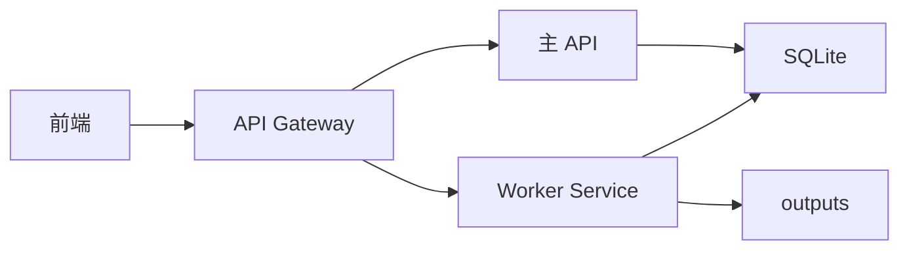

# Worker Service 拆分说明

结论：`worker-service` 是第一步真正拆出来的后端服务边界。它让 Gateway 可以把任务、图片生成、视频生成请求转发到独立进程，同时保留现在的单体运行方式。

## 5 分钟版

| 模式 | 启动命令 | 用途 |
| --- | --- | --- |
| 单体模式 | `npm run start:all` | 一个进程同时跑 API 和本地队列，适合本地调试 |
| API-only | `npm run start:api` | 只处理 HTTP API，不消费生成任务 |
| Worker-only | `npm run start:worker` | 不提供 HTTP，只扫描数据库并消费 queued 任务 |
| Worker Service | `npm run start:worker-service` | 提供 `/api/tasks`、`/api/images`、`/api/videos`，也可消费队列 |
| Asset Service | `npm run start:asset-service` | 提供素材列表、上传、读取和素材集合 |

第一版建议这样用：

```bash
npm run start:api
npm run start:worker-service
```

然后在 API/Gateway 进程里配置：

```bash
WORKBENCH_GATEWAY_WORKER_URL=http://127.0.0.1:3001
```

这样 `/api/tasks/*`、`/api/images/*`、`/api/videos/*` 会先转发给 worker-service。没配置时，仍然走当前单体 routes。

## 为什么先拆它

图片和视频生成最耗时，也最容易占满请求进程。先把 worker-service 拆出来，可以让前端请求和生成任务压力分开。

这一步不要求你马上上多台机器。它先把边界做出来：



## worker-service 负责什么

| 路由 | 职责 |
| --- | --- |
| `GET /api/tasks` | 查看当前用户任务历史 |
| `GET /api/tasks/:taskId` | 查看任务详情 |
| `POST /api/tasks/:taskId/cancel` | 取消排队或运行中的任务 |
| `POST /api/tasks/:taskId/retry` | 重试失败的文本、图片或视频任务 |
| `POST /api/images` | 创建图片生成任务 |
| `POST /api/videos` | 创建视频生成任务 |
| `GET /api/videos/:taskId` | 查询上游视频任务 |
| `GET /api/health` | 给负载均衡或进程探活 |

它不负责这些模块：

| 不负责 | 应该留给 |
| --- | --- |
| 登录、注册、Session | `auth-service` 或当前主 API |
| API Key 管理、模型能力 | `model-service` 或当前主 API |
| 素材库读取、上传、集合 | `asset-service` 或当前主 API |
| 工作流保存、版本 | `workflow-service` 或当前主 API |

## 推荐配置

worker-service 默认只监听本机：

```bash
WORKBENCH_WORKER_SERVICE_HOST=127.0.0.1
WORKBENCH_WORKER_SERVICE_PORT=3001
WORKBENCH_WORKER_SERVICE_START_QUEUE=true
```

如果你用 Gateway 转发：

```bash
WORKBENCH_GATEWAY_WORKER_URL=http://127.0.0.1:3001
```

如果 worker-service 和 Gateway 不在同一台机器，建议加内部服务 token：

```bash
WORKBENCH_INTERNAL_SERVICE_TOKEN=换成一段随机长字符串
```

Gateway 转发时会自动附带 `x-workbench-internal-token`。worker-service 配置同一个 token 后，会拒绝没有内部 token 的直接请求。

## 身份规则

worker-service 不直接处理浏览器登录。它只信任 Gateway 注入的内部用户头：

```text
x-workbench-user-id
```

Gateway 会先丢弃浏览器伪造的内部头，再重新写入已登录用户 ID。server 模式下，如果请求没有这个用户上下文，worker-service 会返回 `401`。

## 和旧 worker 的区别

| 进程 | 是否有 HTTP | 是否创建任务 | 是否消费任务 |
| --- | ---: | ---: | ---: |
| `start:api` | 是 | 是 | 否 |
| `start:worker` | 否 | 否 | 是 |
| `start:worker-service` | 是 | 是 | 默认是 |

`start:worker` 更像纯后台消费者。`start:worker-service` 是未来拆服务时的 HTTP 服务边界。

## 验证命令

```bash
node --test server/workerServiceApp.test.cjs server/gatewayService.test.cjs server/processBoundary.test.cjs
node --check server/workerServiceApp.cjs
node --check server/workerService.cjs
```

完整回归仍然跑：

```bash
npm test
npx tsc -b --pretty false
npm run lint
npm run build
```
