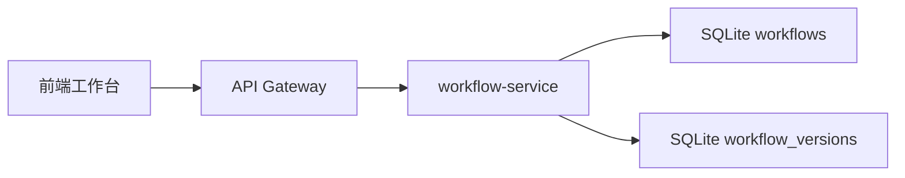

# Workflow Service 拆分说明

结论：`workflow-service` 负责工作流保存、列表、版本、恢复、复制和删除。它默认只监听本机，公网入口仍然应该是 Gateway。

## 5 分钟版

启动 workflow-service：

```bash
npm run start:workflow-service
```

默认监听：

```bash
WORKBENCH_WORKFLOW_SERVICE_HOST=127.0.0.1
WORKBENCH_WORKFLOW_SERVICE_PORT=3005
```

让 Gateway 转发工作流请求：

```bash
WORKBENCH_GATEWAY_WORKFLOW_URL=http://127.0.0.1:3005
```

配置后，这些请求会进入 workflow-service：

| 路由 | 用途 |
| --- | --- |
| `/api/workflows` | 创建和分页查看工作流 |
| `/api/workflows/:workflowId` | 查看、更新、删除单个工作流 |
| `/api/workflows/:workflowId/duplicate` | 复制当前工作流 |
| `/api/workflows/:workflowId/versions` | 查看工作流版本 |
| `/api/workflows/:workflowId/versions/:versionId` | 查看单个版本 |
| `/api/workflows/:workflowId/versions/:versionId/restore` | 恢复到历史版本 |
| `/api/workflows/:workflowId/versions/:versionId/duplicate` | 从历史版本复制新工作流 |

## 为什么要拆它

工作流是产品的核心业务数据。它和生成任务不同，不应该被图片、视频等耗时任务拖慢。把它拆成独立服务后，后续可以继续扩展模板、版本对比、多人协作、发布市场。



## 身份规则

workflow-service 不直接读取浏览器 Cookie。它只信任 Gateway 注入的内部用户上下文：

```text
x-workbench-user-id
x-workbench-user-role
```

server 模式下，如果请求没有 `x-workbench-user-id`，workflow-service 会返回 `401`。如果配置了内部 token，还需要：

```text
x-workbench-internal-token
```

## 它负责什么

| 能力 | 说明 |
| --- | --- |
| 用户隔离 | 每个用户只能看到自己的工作流 |
| 版本记录 | 每次保存会形成版本快照 |
| 恢复版本 | 可以把某个历史版本恢复为当前工作流 |
| 复制工作流 | 可以复制当前工作流或某个历史版本 |
| 输入限制 | 限制节点、连线、名称、描述和 metadata 大小 |

## 它不负责什么

| 不负责 | 应该留给 |
| --- | --- |
| 登录、注册、Session | `auth-service` |
| 图片、视频、文本任务执行 | `worker-service` 或 `worker` |
| 素材上传、读取、集合 | `asset-service` |
| API Key、模型能力、厂商适配 | `model-service` |

## 验证命令

```bash
node --check server/workflowServiceApp.cjs
node --check server/workflowService.cjs
node --test server/workflowServiceApp.test.cjs server/gatewayService.test.cjs server/processBoundary.test.cjs
```

完整回归：

```bash
npm test
npx tsc -b --pretty false
npm run lint
npm run build
```
